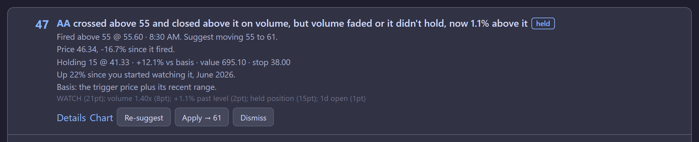
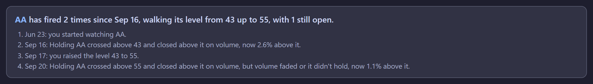
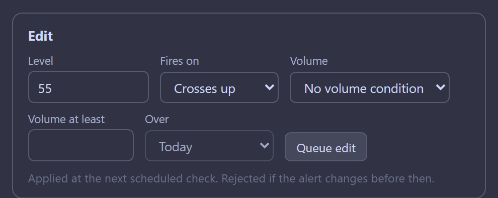
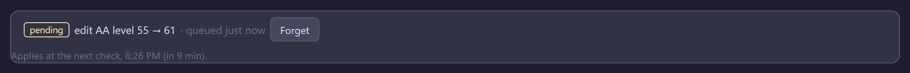
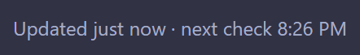

# equity-watch

A self-managed alert engine for equities, built to replace a capped, paid alert
subscription. It watches price levels, trailing stops, volume, and moving
averages against Schwab market data. When an alert fires it never disarms: the
firing lands in a **revisit queue**, a durable to-do list of levels that got taken
out and now need a decision.

A browser dashboard shows that queue, recent triggers, your holdings, and every
live alert — and acts on them: propose a new
level for a fired alert and apply it, add or edit any kind of alert, manage lots and
stops. Everything that holds state (alerts, positions, queue) lives in flat JSON
files on one machine. The cloud only holds a rendered copy of what that machine
published, plus a mailbox of changes waiting to be collected.

**You need:** Node.js, and a Schwab developer app with the Market Data product
([`docs/SETUP.md`](docs/SETUP.md)). **Optional:** an AWS account for the browser
dashboard, and a free Financial Modeling Prep key for sector data and correct chart
links.

## Contents

- [Quick start](#quick-start) and the [command map](#command-map)
- [How it works](#how-it-works) and [a worked example](#a-worked-example)
- [What runs by itself, and what you do](#what-runs-by-itself-and-what-you-do)
- [The four alert kinds](#the-four-alert-kinds)
- [Deploying the dashboard (optional)](#deploying-the-dashboard-optional)
- [When something breaks](#when-something-breaks)
- [Reference](#reference) · [Development](#development)

---

## Quick start

`docs/SETUP.md` covers registering the Schwab app and the one-time OAuth login. Then:

```bash
npm install
npm run build
node dist/cli.js schwab-login        # interactive OAuth; re-run weekly
node dist/cli.js alert add GMED 80.5
node dist/cli.js alert check
node dist/cli.js dashboard
```

The examples here spell out `node dist/cli.js`. `npm link` gets you `equity-watch ...`
instead, and `npm run cli -- alert check` runs from `src/` via `tsx` and skips the
build. Every command and command group (`alert`, `alert revisit`, `holdings`,
`holdings stop`, `ops`, `profile`) supports `--help`. A bare ticker is a shortcut
for "show me everything on this symbol": `node dist/cli.js TSLA`.

To run it unattended, register `scripts\check-and-publish.ps1` with Task Scheduler
(or `scripts/check-and-publish.sh` with cron); see [`docs/SCHEDULING.md`](docs/SCHEDULING.md).

### Command map

| command | what it does |
|---|---|
| `<SYMBOL>` | Show one ticker's alerts |
| `schwab-login` | Interactive Schwab OAuth login; needed again every 7 days |
| **Alerts** | |
| `alert add` / `edit` / `remove` / `list` | Manage static, trailing, volume, and moving-average alerts |
| `alert check` | One polling pass against live quotes — **this is what the scheduler runs** |
| `alert seed` | One-time migration of the two TradingView CSV exports |
| `alert migrate-directions` | One-time upgrade of stores written before directions existed |
| **The revisit queue** | |
| `alert revisit list` | List entries, highest priority first |
| `alert revisit relevel` | Fetch bars, propose new levels, score the queue |
| `alert revisit apply <id>` | Move the alert to the proposed level and close the entry |
| `alert revisit dismiss <id>` | Close the entry, leave the alert alone |
| **Holdings** | |
| `holdings import` | One-time import of Webull holdings CSV exports |
| `holdings add-lot` / `list` | Record and review purchase lots |
| `holdings cover` | Give every uncovered position a starting alert |
| `holdings check` | The three basis-relative conditions |
| `holdings stop add` / `list` / `remove` | Record stops (not live-monitored) |
| **Output** | |
| `dashboard` | The periodic document: terminal view, JSON, static site, or S3 publish |
| `analyze` | Breakout-confirm a TradingView CSV (`--csv`) or your own triggers (`--from-alerts`) |
| **Dashboard edits** | |
| `ops pull` | Apply changes queued from the browser (no-op without `OPS_QUEUE_URL`) |
| `ops apply` | Apply one op from a JSON file, no AWS involved |
| **Reference data** | |
| `profile fetch` / `list` / `show` | Sector/industry/exchange cache from Financial Modeling Prep |

Flags that recur across groups: `--alerts-file`, `--revisits-file`, `--holdings-file`,
`--config`, `--cache-dir`/`--no-cache`, `--profile-cache-dir`, and
`--app-key`/`--app-secret`/`--token-path` (or `SCHWAB_APP_KEY` / `SCHWAB_APP_SECRET`
in `.env`).

---

## How it works

One scheduled script on one machine does everything, every 15 minutes through the
trading day. Each run is four commands, and the order is the point:

```
   ┌───────────────────────────────────────────────────────────────┐
   │  every 15 min, weekdays (Task Scheduler / cron)                │
   │                                                                │
   │  1. ops pull        apply edits you queued from the dashboard  │
   │  2. holdings cover  give any uncovered position a first alert  │
   │  3. alert check     poll quotes → fire alerts → append to queue│
   │  4. dashboard --publish --skip-unchanged  → the browser page   │
   └───────────────────────────────────────────────────────────────┘

   alerts.json   revisits.json   holdings.json     ← all local, never uploaded
```

- **`ops pull` runs first** so the same run's `alert check` evaluates the changes you
  just made from the page.
- **`holdings cover` sits between them** so a lot you added from the page gets a
  starting alert in the same cycle.
- **`alert check`** exits without spending a quote request when the market is closed.
- **`dashboard --publish --skip-unchanged`** decides whether anything happened
  *before* fetching quotes, so a quiet run costs zero API calls.

**Alerts never disarm.** A firing appends to the revisit queue and the alert keeps
watching at its original level, so nothing stops being monitored while an entry sits
there waiting for you. Re-fire suppression, per kind, is in
[`docs/ALERTS.md`](docs/ALERTS.md#alerts-never-disarm).

## A worked example

One alert on AA, from typing it to deciding what to do about it. The screenshots come
from the Playwright fixture server, so every symbol, level and position in them is
invented.

**1. You add it.** AA is trading around 38, and you want to hear about 43.

```bash
node dist/cli.js alert add AA 43
```

The alert is recorded as a **below-side** alert watching for an **upward** crossing.
The side is inferred from the live price; you never pick it.

**2. The scheduled runs poll it.** Each `alert check` fetches one quote batch covering
every live alert and position, sees AA below 43, and does nothing. Those runs publish
nothing, because nothing changed.

**3. It fires.** AA trades 44.10. In that one run, automatically: a revisit entry is
appended to `revisits.json` recording the level, the trigger price, the session and
the alert's condition *in words as it stood at that moment*; the alert **stays live at
43**; `reports/alert_triggers_<timestamp>.csv` is written; and the dashboard is
published, so an open tab toasts it. If AA crossed back under 43 within the next
`holdDays` trading days, that crossing would be **folded onto this same entry** as the
reversal rather than queued separately.

**4. You ask what to do about it.** Nothing re-levels itself, so the queue waits for
you. *Suggest level* on the row pulls daily bars for that entry, proposes a level and
scores it; *Apply → 55* takes it. The same thing over the whole queue, from the CLI:

```bash
node dist/cli.js alert revisit relevel
node dist/cli.js alert revisit apply rv0000a1
```

Either way the alert moves to 55, its crossing baseline is re-seeded so it doesn't
fire just because the level moved, and the entry closes as `applied` with the move
recorded. Both run the same code, so both propose the same level.

**5. It fires again, and this one needs a decision.** AA takes out 55 too, at 55.60.
The queue row is the whole verdict in one place: priority, the English headline, the
`held` tag because AA is in `holdings.json`, what has happened since, and the signal
breakdown behind the score:



The score is not a recommendation to buy. It ranks what most deserves your attention,
and `held position (15pt)` is part of why this one is at the top.

**6. Details, if the headline isn't enough.** *Details* opens the trigger drawer.
Everything here except the current price was recorded when it fired, so it stays true
even after you move or delete the alert:


**7. The story is the part a flat list hides.** Two fires with the re-level between
them, which is the chase the queue exists to make visible:



**8. You decide, from the page this time.** With editing unlocked, the alert's drawer
carries an edit form, price and volume together. (The queue row's *Suggest level* and
*Apply* from step 4 are the shortcut when you agree with what it proposes; this is
for when you don't.)



**9. Nothing pushes to the machine, so the page says when.** *Queue edit* posts the op
and the row says what it is waiting for, from the scheduler's own next-run time:



The header carries it too, so a drained queue still answers "when does this refresh?":



**10. The next run closes the loop.** Its `ops pull` applies the edit (closing the
alert's open queue entries), `alert check` evaluates AA against the new level in the
same run, and the publish carries the result back, so the pending row resolves into
applied or rejected with a reason. How that round trip works:
[`docs/ARCHITECTURE.md`](docs/ARCHITECTURE.md#closing-the-loop).

## What runs by itself, and what you do

### Automatic, every scheduled run

| | |
|---|---|
| Applying dashboard edits | `ops pull` drains the SQS queue until it is empty and logs every result |
| Covering new positions | `holdings cover` gives any held symbol with no live alert a starting level |
| Polling | `alert check`: one quote batch for every live alert and position, gated on Schwab's real market hours (half days included) |
| Firing and queueing | triggers append to `revisits.json` with a snapshot of the alert as it was |
| Publishing | `dashboard --publish --skip-unchanged`, which skips quotes entirely on a quiet run |
| The page itself | re-fetches `dashboard.json` every minute, toasts new triggers, counts down to the next check |

Also automatic, but **only while a browser tab is open**: OS notifications for new
triggers (background tab, other window, or minimized, but not once the tab is closed;
that would need Web Push, which nothing sends yet).

### Things you do

| | how often |
|---|---|
| `schwab-login` | **weekly.** Schwab's refresh token lives 7 days and only an interactive browser flow renews it |
| `npm run build` | after any change under `src/`. The scheduled task runs `dist/`, not `src/` |
| `alert revisit relevel`, or *Suggest level* on a queue row | when you want proposed levels and priority scores. The scheduled run does **not** do this: an entry has no `suggestedLevel` or priority until you ask, per entry from the page or over the whole queue from the CLI |
| `alert revisit apply` / `dismiss`, or *Apply* / *Dismiss* on the page | deciding what to do about a queue entry. Nothing ever re-levels itself |
| `holdings check` | the three basis-relative conditions; not in the scheduled run, and daily is plenty. The page shows the two of them that are state rather than events |
| `analyze` | breakout-confirming a batch of triggers, once or twice a day at most |
| `profile fetch` | topping up the sector/exchange cache (250/day free tier) |
| `holdings import` / `add-lot` | when positions change; there is no brokerage sync |

Two deliberate non-features, so you don't go looking for them:

- **There is no "apply now" button.** The page is static files on S3 and the Lambda
  can only write to SQS; nothing in AWS can reach the machine. A queued edit lands at
  the next scheduled check, and the page's job is to say when
  ([why](docs/ARCHITECTURE.md#state-is-local-the-cloud-is-a-mailbox)).
- **Stops are record-keeping only.** Nothing fires when price crosses one yet.

---

## The four alert kinds

`alerts.json` is the source of truth. It exists partly because TradingView has no API
to read your pending alerts back out.

```bash
# Static: fires when price crosses a level in the watched direction (up by default)
node dist/cli.js alert add GMED 80.5
node dist/cli.js alert add --symbol AAPL --level 150 --direction down    # or: either

# Trailing: fires on a bounce or pullback of N% or $N from a running low/high
node dist/cli.js alert add --symbol AAPL --near 150 --trail-percent 3

# Volume: an absolute share count (2.5M) or a multiple of typical volume; standalone
# or AND-ed onto a static/trailing alert
node dist/cli.js alert add --symbol AAPL --volume-at-least 2.5M
node dist/cli.js alert add --symbol AAPL --level 150 --volume-ratio 1.5

# Moving average: fires on a cross of, or touch of, an SMA/EMA
node dist/cli.js alert add --symbol AAPL --ma sma200@1W
```

Three rules that surprise people:

- **Side is inferred, and it is not the direction.** Above or below is worked out
  from the live price when you add it. A level *below* the price with the default
  `--direction up` fires only when price drops under it and comes back up through it.
- **One live alert per symbol and side.** `alert add` and the dashboard replace the
  existing one (you typed the level you want); `alert seed` and `holdings cover` keep
  whichever is closer to the price.
- **Prefer `--volume-ratio` to an absolute volume.** A fixed threshold rots silently as
  liquidity changes; an imported one fired on 82 of 82 sessions.

All four kinds can also be added and edited from the dashboard, with the same
validation: the New alert form takes a kind and shows only the fields it needs.

Everything else (volume windows and baselines, moving-average semantics, market hours,
the revisit queue and its scoring, `alert seed`) is in
[`docs/ALERTS.md`](docs/ALERTS.md).

## Deploying the dashboard (optional)

`infra/cloudformation.yaml` creates a private S3 bucket, a CloudFront distribution,
and a publish-only IAM user. Put the stack's settings in `.env` (see
[`.env.example`](.env.example) for the full list) and deploy with the script:

```bash
./scripts/deploy-stack.sh              # or: .\scripts\deploy-stack.ps1
./scripts/deploy-stack.sh --dry-run    # print the resolved parameters, deploy nothing
```

It reads every parameter from `.env` — bucket, region, ops token, custom domain,
hosted zone, basic auth — and a `Key=Value` argument overrides one for that run.
Then copy the stack outputs into `.env` (`S3_BUCKET`, `AWS_REGION`,
`AWS_ACCESS_KEY_ID`, `AWS_SECRET_ACCESS_KEY`).

**Use the script rather than `aws cloudformation deploy` by hand.** Every parameter
in the template defaults to empty or false, so a deploy that omits one *clears it on
the live stack*: leave `EnableOps` out and the Lambda, the queue and `/api/*` are
deleted; leave `CustomDomain` out and the alias and its certificate go with it.
Nothing warns you, and the site looks fine until the next queued edit vanishes. The
script passes all of them every time, and refuses to deploy if a value the live
stack has set would resolve to empty here.

A custom domain is optional — leave `CUSTOM_DOMAIN` empty and the site serves from
the distribution's `*.cloudfront.net` URL. With one set, the template requests a
certificate and adds the alias record, and the first deploy waits a few minutes on
DNS validation. `HOSTED_ZONE_ID` must be the **public** Route 53 zone; a private zone
of the same name is easy to pick by mistake and works for neither.

- **Preview locally first:** `node dist/cli.js dashboard --site site`, then serve
  `site/` with any static server.
- **Publish:** `node dist/cli.js dashboard --publish --skip-unchanged --quiet`.
- **Editing from the page** needs `OPS_QUEUE_URL` and a 32+ character `OPS_TOKEN` in
  `.env`. Generate the token with `openssl rand -hex 32`; a memorable one makes the
  holdings vault brute-forceable.
- **The site is public by default.** Alerts, levels, triggers, and *which* symbols you
  hold are visible to anyone with the URL; share counts, basis, value, and stops are
  not published. Turn on basic auth if that isn't acceptable. The full model:
  [`docs/ARCHITECTURE.md`](docs/ARCHITECTURE.md#what-the-token-protects-and-what-it-doesnt).

## When something breaks

- **Everything that needs a quote exits with code 3, or the page says "checks paused,
  login expired".** The Schwab login lapsed (they last 7 days). On the machine that
  runs the checks: `node dist/cli.js schwab-login`. Queued edits wait and are applied
  on the next run. Why it behaves this way:
  [`docs/ARCHITECTURE.md`](docs/ARCHITECTURE.md#when-the-schwab-login-expires).
- **A code change didn't show up on the page.** Nothing rebuilds `dist/` for you. Run
  `npm run build`, and the next check publishes. A field that arrives empty is usually
  a stale `dist/`, not missing data.
- **A command "worked" but printed nothing.** On Windows, check for output, not just
  exit code 0, and see `CLAUDE.md` before touching `src/entrypoint.ts`. An importer
  that finds zero rows is usually being fed the wrong TradingView CSV schema.
- **A queued edit is still "pending".** It applies at the next scheduled check; the
  page shows when. If that time has passed, the scheduled task isn't running.

---

## Reference

| doc | covers |
|---|---|
| [`docs/SETUP.md`](docs/SETUP.md) | Schwab app registration, `.env`, first login, FMP key |
| [`docs/SCHEDULING.md`](docs/SCHEDULING.md) | Task Scheduler / cron setup and the reasoning |
| [`docs/ALERTS.md`](docs/ALERTS.md) | Alert kinds in depth, volume baselines, moving averages, market hours, re-fire rules, the revisit queue and its scoring, `alert seed` |
| [`docs/HOLDINGS.md`](docs/HOLDINGS.md) | Lots and stops, `holdings cover`, the Webull import, basis-relative alerts |
| [`docs/DASHBOARD.md`](docs/DASHBOARD.md) | Terminal and browser dashboard, views, notifications, headlines and stories |
| [`docs/ANALYSIS.md`](docs/ANALYSIS.md) | `analyze` breakout confirmation, `analysis.config.json` tuning, the FMP profile cache |
| [`docs/ARCHITECTURE.md`](docs/ARCHITECTURE.md) | The Lambda/SQS edit round trip, the encrypted holdings vault, the Schwab login expiry, encryption and threat model |

## Development

```bash
npm test          # eslint over web/ and src/, typecheck of src/ and tests/, then vitest
npm run lint      # eslint alone
npm run typecheck
npm run test:ui   # Playwright tests of the page's editing controls
```

Real financial data stays out of git (`holdings.json`, `alerts.json`, `revisits.json`,
`webull_*.csv`); the tests run against anonymized fixtures in `tests/fixtures/`.
`analysis.config.json` must stay in the repo root.

**`CLAUDE.md` documents the patterns in this codebase that look wrong and are
load-bearing. Read it before refactoring anything here.** It also covers regenerating
the README screenshots (`playwright/screenshots.ts`).
