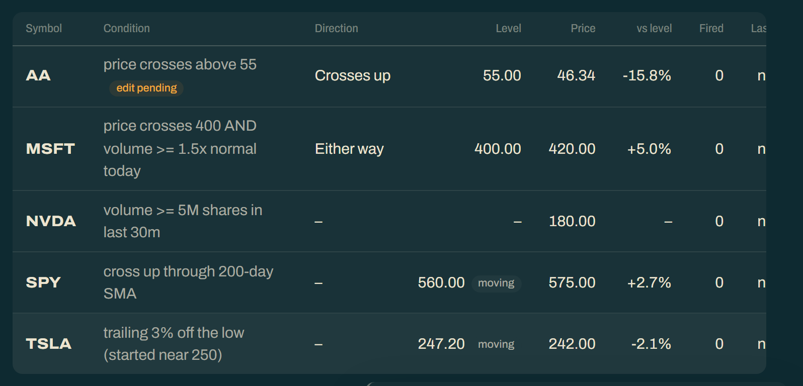

# The dashboard

Reference for the terminal `dashboard` command and the browser site built from the
same document. Editing, the queue behind it, and the security model are in
[ARCHITECTURE.md](ARCHITECTURE.md).

The three CSV writers above (`breakout_report_*`, `alert_triggers_*`,
`holdings_alerts_*`) are event logs: each covers one subsystem and is only written
when something fired. A periodic dashboard needs the opposite — one document,
emitted on a schedule, that's just as meaningful on a quiet day as on a busy one.

```bash
node dist/cli.js dashboard                        # terminal view + reports/dashboard_<timestamp>.json
node dist/cli.js dashboard --quiet --out out.json
node dist/cli.js dashboard --approaching --within-pct 3 --limit 40
```

Six sections, in the order they print:

1. **Summary** — live alerts, symbols covered, open vs. actionable queue entries,
   triggers in the last `--window-days` (default 7), positions held, and how many
   alerts had no quote this run.
2. **Revisit queue** — what needs a decision, priority-ranked, each row carrying its
   proposed level and the signal breakdown behind its score. Capped at `--limit`
   (default 25).
3. **Stories** — tickers that have fired more than once, threaded into a narrative
   (below).
4. **Approaching** — *off by default*; pass `--approaching`. Live alerts within
   `--within-pct` (default 5%) of firing, sorted by distance, capped at `--limit`
   with the true total reported. The arrow carries the side, so a downside alert
   reads unambiguously (`WFC 90.48 ↓ 90.40` needs price to *fall*); a negative
   distance means the price condition is already met and the alert is only still
   live because a volume gate hasn't caught up.

   It defaults off because on a 500-alert book roughly a hundred names sit within a
   few percent of firing at any moment — that's a readout of market noise, not a
   list of things to do. The revisit queue says what actually *happened*, which is
   the part worth a glance.
5. **Quiet** — names watched a long time that have never fired and have barely
   moved: alert slots you could spend elsewhere.
6. **Holdings** — each position against blended basis with current value.

JSON rather than CSV because it's a nested document with per-row signal breakdowns
meant to be fed to something, not opened in a spreadsheet. One Schwab quote request
covers every live alert and position; if that request fails, the document still
renders without live prices rather than failing the run.

## Browser dashboard (`web/`, `src/web/`)

The same document, rendered as a static site you can leave open in a tab:

```bash
node dist/cli.js dashboard --site site          # writes site/ (index.html, app.js, sw.js, dashboard.json)
cd site && python3 -m http.server 8000          # preview at http://localhost:8000
node dist/cli.js dashboard --publish --skip-unchanged --quiet   # sync to S3 (implies --site site)
```

The page itself is fixed; only `dashboard.json` changes between runs, and the page
re-fetches it every minute. It adds a `recentTriggers` list to the document (every
firing in the window, newest first, any status) because the revisit queue is
priority-sorted and capped, so it can't tell you what's *new*. Open entries older
than the window are included too, so every queue row has details to open.

**Views.** The header switches between **Overview**, **Revisit queue** (`#/queue`),
**Stories** (`#/stories`), **Alerts** (`#/alerts`), and — once editing is unlocked —
**Holdings** (`#/holdings`). All are routes in the same page, so polling and
notifications keep running on any of them.

- **Overview** — the summary tiles, recent triggers, holdings (when published), and
  quiet watches.
- **Revisit queue** — open triggers by priority. Each row has *Details*, *Chart*, a
  **Dismiss** button that queues a `revisit.dismiss` op, and — when `relevel` has
  proposed a level — a copy-command button for `alert revisit apply <id>`.
- **Stories** — each multi-trigger thread as a narrative.
- **Alerts** — every live alert, from its own `alerts.json`, fetched only while that
  view is open so the every-minute poll of `dashboard.json` stays small. Each row
  shows the condition in words, its level, the current price and distance, how often
  it has fired, and when. You can search, filter by kind, and sort (symbol, closest
  to level, most triggered, recently fired, newest). A trailing trigger or moving
  average shows as "moving". An A–Z rail appears under the symbol sort. Click a row
  for its details and recent triggers.

  

  One row per kind, above: the static alert carries an **edit pending** tag, the
  moving-average and trailing rows show their level as **moving**, and the volume
  alert has no level or direction to show at all.
- **Holdings** — positions, lots, and stops, decrypted from `vault.json` in the
  browser. Only present once editing is unlocked.
- **Trigger details** (`#/trigger/<id>`) open from any recent trigger, queue row,
  toast, or notification, in a drawer over the current view. They show when it
  fired, its status, the alert's condition at that moment, price vs. level, the
  volume it saw against what was required, the breakout verdict and priority
  breakdown, any suggested level, and a link to the alert.

**Editing.** With the ops stack deployed, you can add and edit alerts, remove them,
dismiss queue entries, and add/edit/remove lots, positions, and stops straight from
the page. Each change is queued and applied by the next scheduled `ops pull` — see
[ARCHITECTURE.md](ARCHITECTURE.md#queueing-a-change-lambda--sqs--ops-pull).

**Notifications.** When a trigger id appears that this browser hasn't seen, the page
shows an in-page toast and, if you've clicked *Enable notifications*, an OS
notification when the tab is in the background or the window is unfocused. The tab
title also gains a `(n)` count.

- Works while the tab is **open anywhere** (background tab, other window,
  minimized). Background tabs are throttled to about one poll a minute, which is the
  poll rate anyway.
- Does **not** work once the tab is closed. That needs Web Push (a service-worker
  subscription plus the publisher sending VAPID-signed pushes); `sw.js` is the piece
  that would receive them, but nothing sends them yet.
- Needs HTTPS (or localhost). On iOS, only a home-screen web app can notify.
- The first visit on a browser marks everything already listed as seen, so it
  doesn't open with a week of backlog.

**Holdings and login are both off by default**, and they go together: with
holdings off, share counts, basis, market value, and stops are removed from the
published JSON (why and how:
[ARCHITECTURE.md](ARCHITECTURE.md#holdings-are-encrypted-in-the-browser-not-hidden-by-the-page)).
To turn both back on:

1. Redeploy the stack with `EnableBasicAuth=true BasicAuthUser=… BasicAuthPassword=…`.
2. Add `"web": { "holdings": true }` to `analysis.config.json`.

**Theme.** Dark by default, using the uniquetrades-congress palette (Catppuccin).
The header toggle remembers a light preference per browser.

**Publishing.** Deploying the S3/CloudFront stack and copying its outputs into `.env`
is in the [README](../README.md#deploying-the-dashboard-optional).

`--skip-unchanged` publishes only when something happened (a trigger, a status
change, a new suggestion, a holdings change, a new op result) or when the published
prices are older than `--max-stale-minutes` (default 30). It decides *before*
fetching quotes, so a quiet run costs no API calls. Last-publish state lives in
`.cache/web_publish.json`.

`scripts/check-and-publish.ps1` (Windows Task Scheduler) and
`scripts/check-and-publish.sh` (cron/WSL) pair this with the check;
[`SCHEDULING.md`](SCHEDULING.md) has the setup and the reasoning. For cron under WSL:

```
*/2 * * * 1-5 /path/to/repo/scripts/check-and-publish.sh >> /path/to/repo/logs/cron.log 2>&1
```

## Narrative

Every queue row carries a `headline` — a plain-English sentence rather than a row of
numbers, because the target display is a small always-on dashboard (a hacked
Kindle), where "TGT crossed above 110 and closed above it on volume" is readable at
a glance and `verdict=CONFIRMED_BREAKOUT vol=2.4x` is not:

```
 75.3  CTVA crossed above 86 and closed above it on volume, now 6.2% above it
         fired 86 @ 88.4. Suggest moving 86 to 93.
 61.7  TGT crossed above 110 and closed above it on volume, in pre-market, now 3.0% above it
 54.4  Holding MKS crossed above 42, then fell back below it the same day
  5.1  LUMN crossed above 3.5 intraday but closed back below
```

Headlines never say "support" or "resistance". Those words mean a level the market
has tested repeatedly, and an alert level is only a number you picked. A reversal (a
crossing back within the window) is stated on the fire it undoes, with its timing.
With 3 or more crossings, it's summarized as a count instead ("crossing it 4 times
in all, ending above it").

`stories` threads one ticker's repeated triggers together with the re-levels between
them, which is the shape a flat list of events hides — the chase that made you
re-arm the same name five times is the whole reason the queue exists:

```
CTVA has fired 3 times since Aug 20, walking its level from 82.1 up to 86,
with 1 still open.
  Aug 20: CTVA crossed above 82.1 and closed above it on volume, now 1.1% above it.
  Aug 21: you raised the level 82.1 to 84.2.
  Aug 26: CTVA crossed above 84.2 and closed above it on volume, now 1.5% above it.
  Aug 27: you raised the level 84.2 to 86.
  Sep 1:  CTVA crossed above 86 and closed above it on volume, now 6.2% above it.
```

These are **template-based, not model-generated** (`src/narrative.ts`), and
deliberately so: the lines describe money decisions, render unattended on a device
with no way to check them, and every claim is read straight off a recorded verdict.
That makes them reproducible, free, instant, and incapable of inventing a fact. The
phrasing is also load-bearing. "Closed above it on volume" is only used where the
verdict supports it. Nothing claims a level "held", because no verdict records that.
A `NO_CLOSE_CONFIRM` says "crossed above 3.5 intraday but closed back below" instead.

Written for e-ink: short lines, no colour, no emoji, no box-drawing, nothing that
needs a monospace grid. A renderer can ignore the terminal view entirely and read
`headline` / `action` / `stories[].summary` straight out of the JSON.

## Watch history

Every alert records `watchingSince` and `priceAtWatchStart` when it's created, which
lets the narrative answer a question the trigger itself can't — *was this worth
watching at all*:

```
 75.3  CTVA crossed above 86 and closed above it on volume, now 6.2% above it
         fired 86 @ 88.4. Suggest moving 86 to 93.
         Up 22% since you started watching it, June 2026 or earlier.

QUIET (1 watched a long time, never fired)
  EMB: watching at least since 04/17/26 (148d), never fired, down only 1.8% since.
```

A name qualifies as *quiet* only when it has been watched **45+ days**, has never
fired, **and** has moved less than **5%**. Something that has moved but not crossed
its level is a working alert, not a dead one, so it stays out of the list.

Seeded alerts are backdated: TradingView's exports carry no creation date, so `alert
seed` uses the oldest trigger on record as a lower bound and marks it approximate —
the narrative then says "June 2026 **or earlier**" rather than asserting a start date
it doesn't have. The price at that date is recovered from the daily bars the seed
already fetches for re-levelling; when the date predates that window the price is
left null and the line states the date without claiming a percentage.
